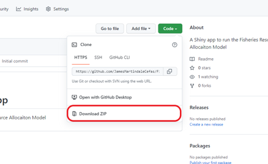
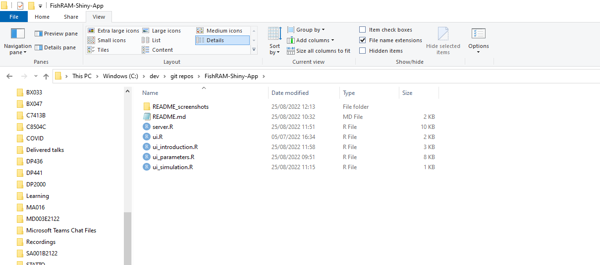
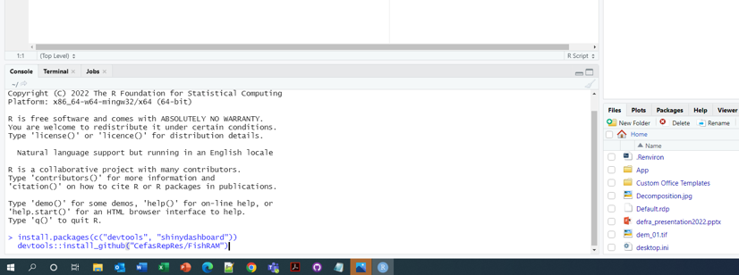
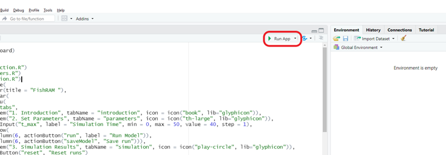
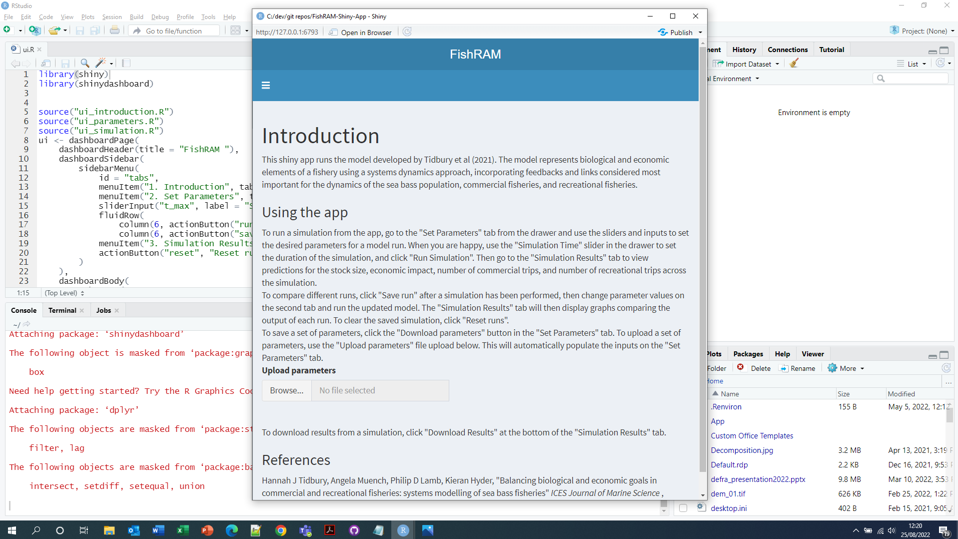

# FishRAM Shiny App

This guide outlines how to download the necessary materials to run the Fisheries Resource Allocation Model (FishRAM) through a Shiny application. 

## Step 1. Download the files
Download the files in this GitHub repo by clicking the green "Code" button in the top right corner of the main pane. Then select "Download ZIP" from the options.



When the ZIP file has finished downloading, extract the files, ensuring that all the `.R` files are in the same folder.



## Step 2. Installing software
If you have already downloaded R and RStudio, skip to step 3.
#### (a) Install R

Download and install R following the instructions at [https://cran.rstudio.com/](https://cran.rstudio.com/).

#### (b) Install RStudio

Download and install RStudio Desktop following the instructions at [https://www.rstudio.com/products/rstudio/download/](https://www.rstudio.com/products/rstudio/download/).


## Step 3. Installing R packages
Open R studio, paste the following code into the console and hit Enter. This will install the R packages that are required to run the app.

``` r
install.packages(c("devtools", "shinydashboard"))
devtools::install_github("CefasRepRes/FishRAM")
```




## Step 4. Running the app

In RStudio, open the ui.R file by navigating to File -> Open File from the RStudio menu. In the top right corner of the text editor there will appear a "Run App" button. 




Click this button to run the FishRAM app.



